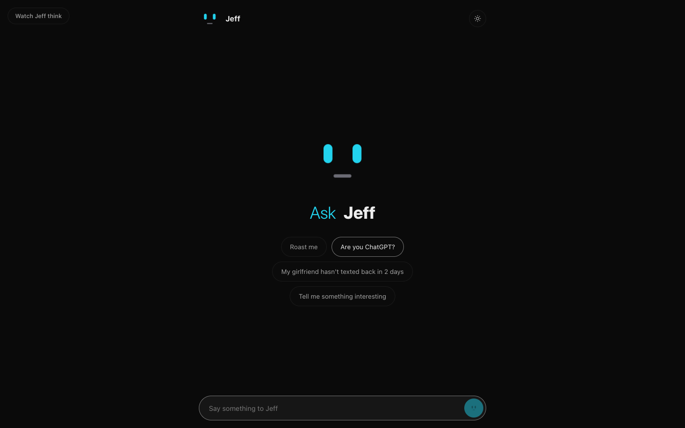

# Jeff

A chatbot that cannot write.

**[Try Jeff](https://askjeff.vercel.app)**



Every visible reply comes from a reviewed line committed to this repository.
[TypeSafe Jev](https://docs.typesafe.ai) scores the line bank and selects the
best match. It never writes Jeff's response.

This keeps generated text out of the chat. Jeff can still choose the wrong line
or misunderstand a message.

## How it works

1. Local rules check for crisis and grief phrases. A match returns a serious
   line without calling TypeSafe.
2. Other messages go to the serverless API with up to four recent turns.
3. TypeSafe scores the candidate lines and classifies safety and relevance
   signals in one request.
4. Local decision code applies the thresholds and returns one checked-in line.

The bank contains 242 lines: 222 regular and safety lines, 13 dodge lines, and
7 short follow-up lines. Read the [implementation reference](docs/FINAL_SPEC.md)
for the complete routing logic.

## Run locally

You need Node.js 20.18.3 or newer and a TypeSafe API key.

```sh
git clone https://github.com/Deepusleepy/jeff.git
cd jeff
cp .env.example .env.local
# Add TYPESAFE_API_KEY to .env.local
npx vercel dev
```

The app is available at the local URL printed by Vercel.

Configuration:

| Variable | Required | Purpose |
| --- | --- | --- |
| `TYPESAFE_API_KEY` | Yes | Server-side credential for TypeSafe |
| `TYPESAFE_MODEL` | No | Model name. Defaults to `jev-latest` |
| `ALLOWED_ORIGINS` | No | Extra exact origins allowed by the API |

Never put the TypeSafe key in client-side JavaScript or commit an environment
file.

## Test

The default suite is offline and does not spend TypeSafe credits.

```sh
npm test
```

The live suite calls TypeSafe for cases that local rules do not handle. Run it
only when you intend to spend account credits.

```sh
TYPESAFE_API_KEY=... npm run test:live
```

## Project layout

```text
index.html          Static frontend
styles/main.css     Layout, themes, and responsive styles
src/                Browser modules
api/chat.js         Vercel function and TypeSafe client
lib/                Line bank, safety rules, scoring questions, and decisions
test/               Offline unit tests and opt-in live tests
docs/               Implementation, privacy, safety, and release notes
```

## Privacy and safety

Do not enter secrets, credentials, or sensitive personal information. The
browser sends the current message and up to four recent exchanges to this
project's API. Most turns then go to TypeSafe for scoring. Hosting and provider
infrastructure may keep its own logs or telemetry.

Jeff is an entertainment project. It is not an emergency, medical,
mental-health, or legal service. Its finite safety rules and model
classifications can miss or misclassify messages. Read the [privacy](docs/PRIVACY.md)
and [safety](docs/SAFETY.md) notes for the exact boundaries.

## Operating a public deployment

The function has a best-effort in-memory limit of 10 requests per minute and 60
per UTC day for each client address. Serverless instances do not share that
memory, and a restart clears it. This is not a global abuse or cost control.

Self-hosters should add platform-level rate limiting or a gateway quota, plus a
spending ceiling or alert. Use the [public release checklist](docs/PUBLIC_RELEASE_CHECKLIST.md)
before exposing a paid endpoint.

## Contributing

Read [CONTRIBUTING.md](CONTRIBUTING.md) before changing the line bank or safety
routing. Report security problems through the private process in
[SECURITY.md](SECURITY.md).

## License

Jeff is available under the [MIT License](LICENSE).
